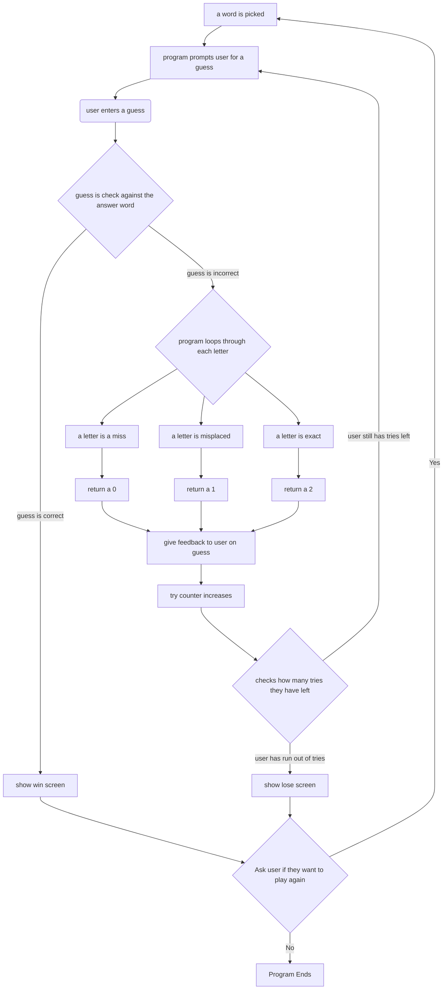
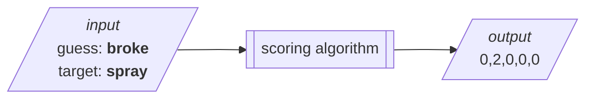
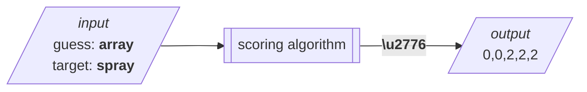
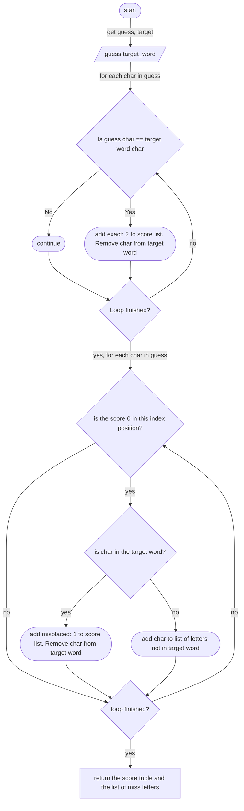

# Guess My Word
`> command line word guessing --game `
---
## Introduction
**Guess-My-Word** is a command line word guessing game inspired by [Wordle:copyright:](https://www.nytimes.com/games/wordle/index.html)


## User Documentation
### How to play
#### Overview 
**Guess-My-Word** is a command line clone of the popular word guessing game [Wordle](https://www.nytimes.com/games/wordle/index.html). Players are given six tries to guess a five-letter word. After each attempt, the program gives clues about the accuracy of the guess. The player uses the clues to adapt their responses.

The player must use a **valid** word in the English language for each attempt.

The game ends when the correct word is guessed (win) or when the number of attempts is exhausted (loss).

#### Objectives and rules

The objective is:
- Guess the five-letter word within six guesses.

The rules are: 
- The guess must be five letters long
- The guess must be a valid word and not contain numbers or special characters
- To win you must guess the word in six guesses

#### Game play

[1] The game will ask the user for a guess

[2] The user must enter their guess

[3] The game will score the guess and provide feedback

[4] The user must keep entering guesses until either they run out or they have guessed the word correctly

[5] The game shows either a win or loose screen

[6] The game will ask if the play wants to play again


## Developer Documentation
### Files and resources
The following files are included in this project:
- This `readme.md`: a description of the project and its content
- `all_words.txt`: a list of all words that can be used as guesses
-  `target_words.txt`: a list of words that can be used as *target* word of the day words. <br>These words are a subset of `all_words.txt`
-  `guess_my_word.py` the implementation of the **Guess-My-Word** game. Note that it contains clues and additional instructions.

### Program flow {#flow}
The program must do the following:
1. Select a word of the day (target_word) at random from `target_words.txt`
2. Ask user for a guess from `stdin` (i.e. input) and validate guess:
     1. Is guess length valid? 
     2. Is guess a valid word (in `all_words.txt`)?
3. Score guess using scoring algorithm (see [scoring](#scoring) )
4. Format score as a hint to the user and display on `stdout` (i.e. print). Score must show which characters in the guess are:
     1. in the correct position
     2. in the incorrect position
     3. not in the target word
5. Check if it is a win (end if True)
6. Check if there are no more tries (end if True)
7. Ask for another guess

#### Flowchart



### Scoring guesses {#scoring}
At the core of **Guess-My-Word** is the scoring **algorithm**. The scoring algorithm takes a 5-character sequence of letters (the ***guess***) and compares it to another 5-character sequence of letters (the ***target***) and scores each character in the guess:
- **0** / Miss
  - The character in the **guess** was not found in the **target** 
- **1** / Misplaced 
  - The character in the **guess** was found in the **target** but in the wrong position
- **2** / Exact
  - The character in the **guess** was found in the **target** in the correct position 

#### Inputs and outputs


The following diagrams demonstrate example input and output:
<br>

<br><br>

<br><br>

##### ❶ complex case breakdown:
1. The *guess* (array) consists of these characters in their respective positions <br>`{0: a, 1: r, 2: r, 3: a, 4: y}` <br><br>scored against *word* (spray):<br>`{0: s, 1: p, 2: r, 3: a, 4: y}`<br><br>Gives:<br>`(0, 0, 2, 2, 2)`<br><br>

   - `(0: a)` is in the target word but there's an exact match in position 3 so <br>score: `0: 0` 
   - `(1: r)` is in the target word but there's an exact match in position 2 so <br>score: `1: 0` 
   - `(2: r)` is in the target word in the exact position so <br>score: `2: 2`
   - `(3: a)` is in the target word in the exact position so <br>score: `3: 2`
   - `(4: y)` is in the target word in the exact position so <br>score: `4: 2`


### Scoring Algorithm pseudocode
```python
# scoring_algorithm (input guess and the target_word)
#   score_list 0, 0, 0, 0, 0
#   letter_list empty
#   for each enumerate index and letter in guess 
#       if letter in index same as letter in index in target_word
#           score_list index = 2 
#           target_word index = none
#
#   for each letter in guess enumerate index and letter
#       if score_list index is 0
#           if letter in target_word
#               score_list index = 1
#               target_word index = none
#           else add letter to letter_list
#
#    return tuple of score_list, letter_list
```
### Scoring Algorithm flowchart



